# MOJ, the MAPS Online Judge

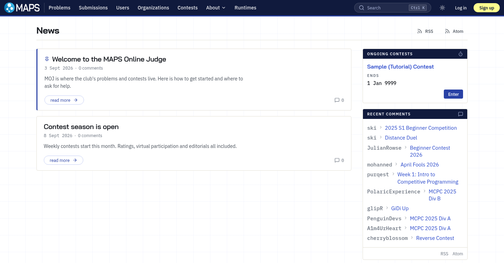

MOJ is an online judge and contest platform written in TypeScript, compatible with
[DMOJ](https://github.com/DMOJ/online-judge). It is maintained by MAPS, Monash Algorithms and Problem Solving.

## Features

* **Over 60 language runtimes**, chosen by the tier of the judge image
* **Live submission status**, with no polling and no event daemon to run
* **Contest formats** for ICPC, IOI, AtCoder and ECOO, with rated contests and virtual participation
* **Hidden scoreboards**, a scoreboard freeze, a reveal ceremony and a hall scoreboard for projectors
* **Screen proctoring**, built in: a proctored contest opens its problems only while the competitor is sharing
  their whole screen, with live monitoring and replay in the staff console
* **Problem statements** in markdown, with maths, images, PDF export and per-language limits
* **Editorials and clarifications**, organisations, classes, comments, tickets and a blog
* A **staff console** with revision history and impersonation
* **Two-factor authentication** with TOTP and passkeys
* An **API** with tokens, and problem repositories deployed by a GitHub Action
* **DMOJ compatibility**: all DMOJ URLs work, the problem and statement format is unchanged, and existing accounts,
  problems, submissions and contests import. See [compatibility](https://binder.monashaps.com/MOJ/guide/compatibility).
* **Light and dark themes**, with the site name, wordmark, colours and CSS as settings

## Installation

Install, configure and run MOJ by following the documentation at
[binder.monashaps.com/MOJ](https://binder.monashaps.com/MOJ/).

## Screenshots

### Problem statements

Statements are markdown with maths, images and syntax highlighting, and they render to PDF. The problem list
filters on solve status, category, points, author and whether an editorial exists, and lives in the URL.

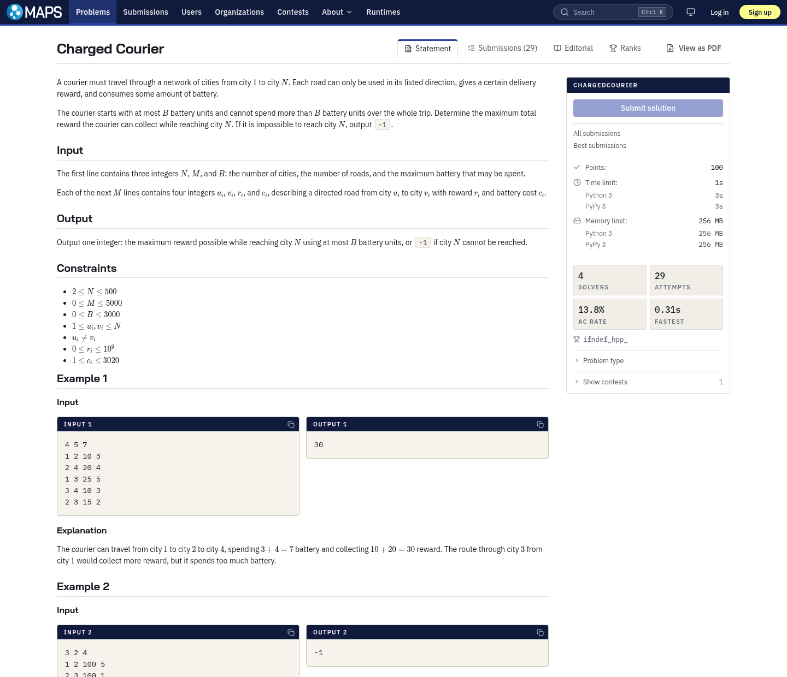

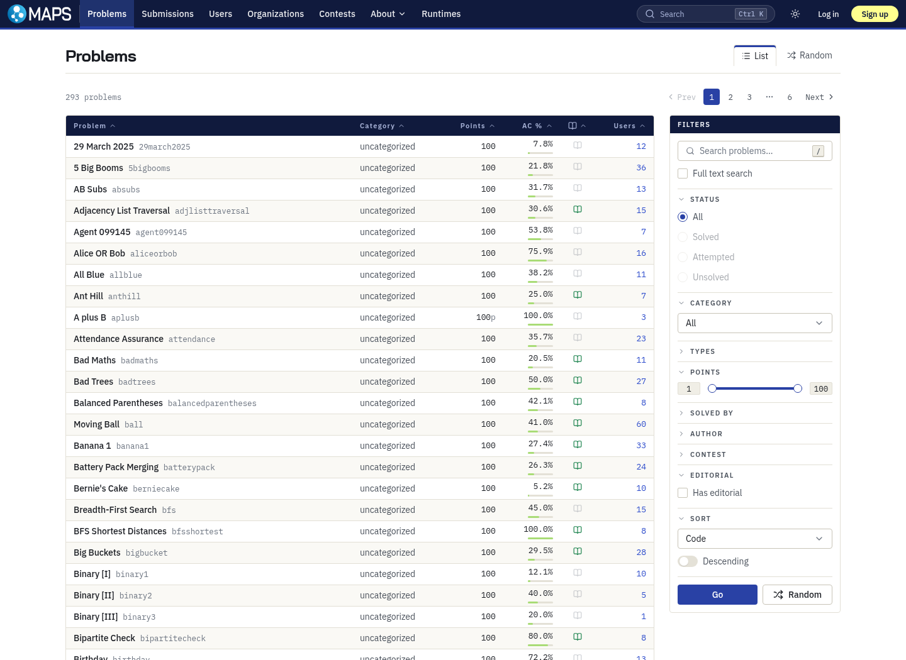

### Submitting

The submit page has an editor, the languages the connected judges can grade, and the problem's limits for them.

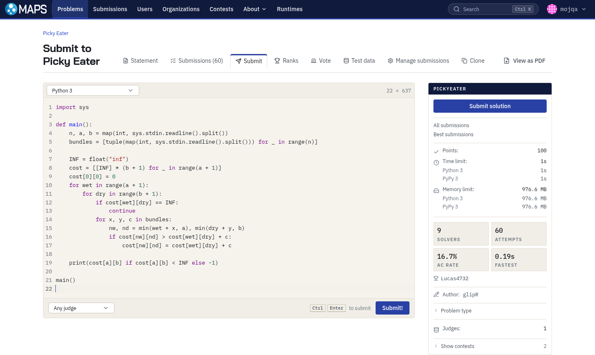

### Live submission status

A submission page updates as the judge reports, case by case inside its batches, and can be aborted or rejudged.

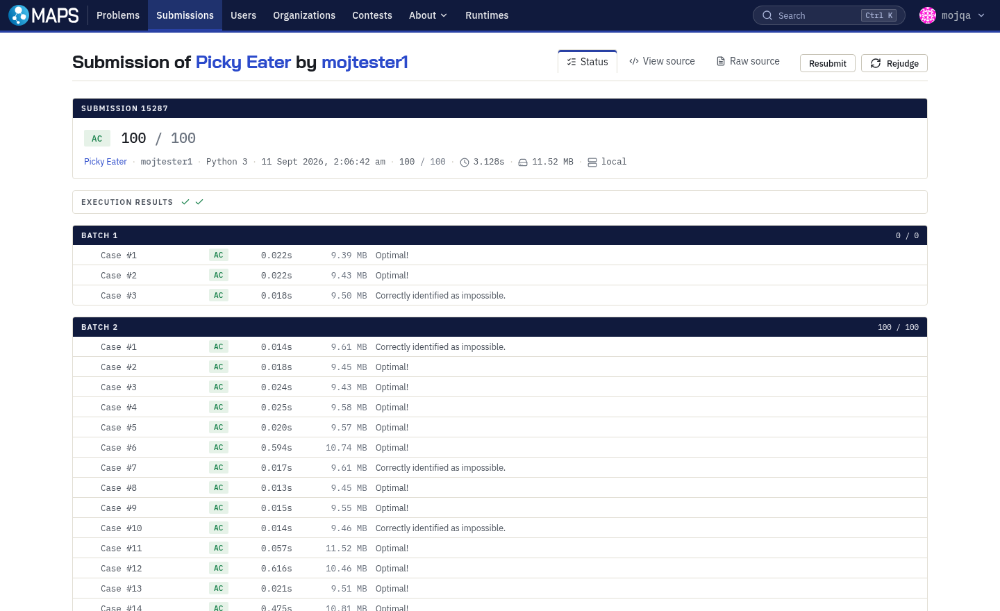

### Submission lists

The global, per problem, per user and per contest lists are live too, and filter by status, language and user.

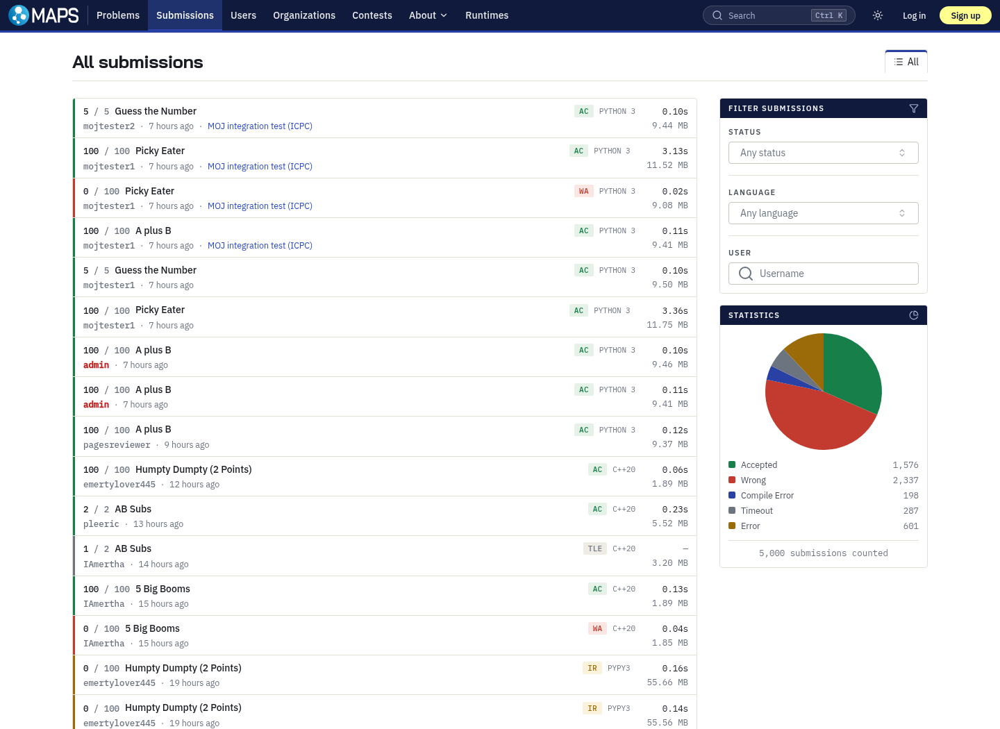

### Contests and rankings

A contest can be rated, hidden until it ends, restricted by access code, joined virtually, and time limited.

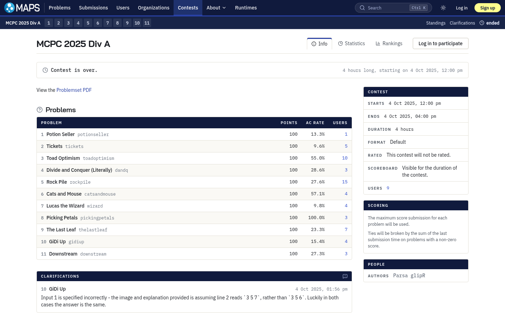

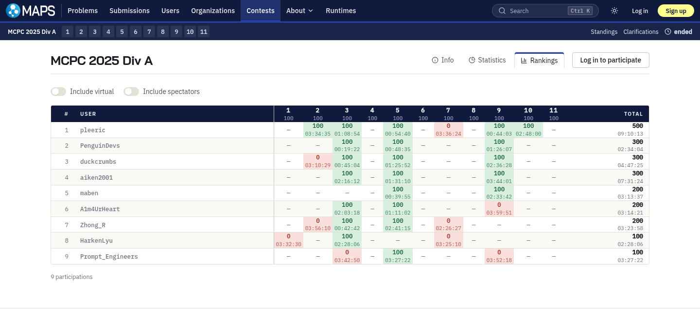

### Hall scoreboard

Several contests can be gathered onto one board for a projector. The reveal turns the frozen cells over one at
a time from the bottom upwards, and it is server-side, so every viewer sees the same cell turn at once.

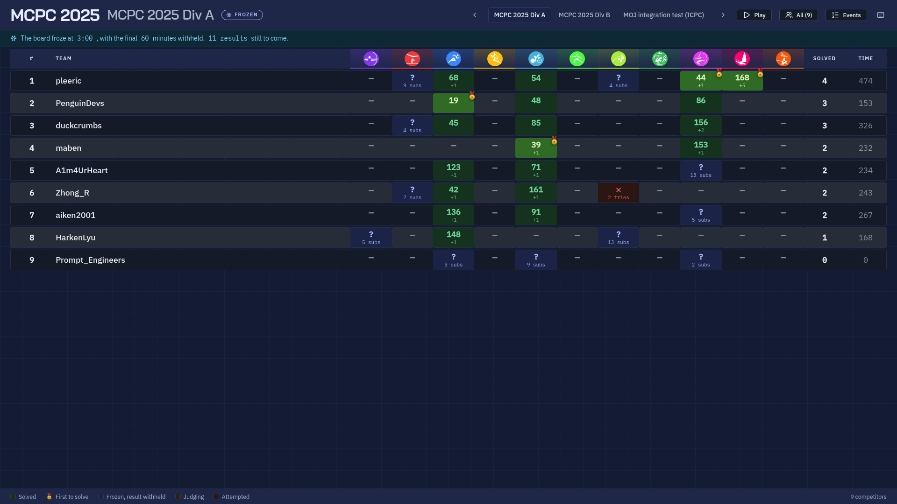

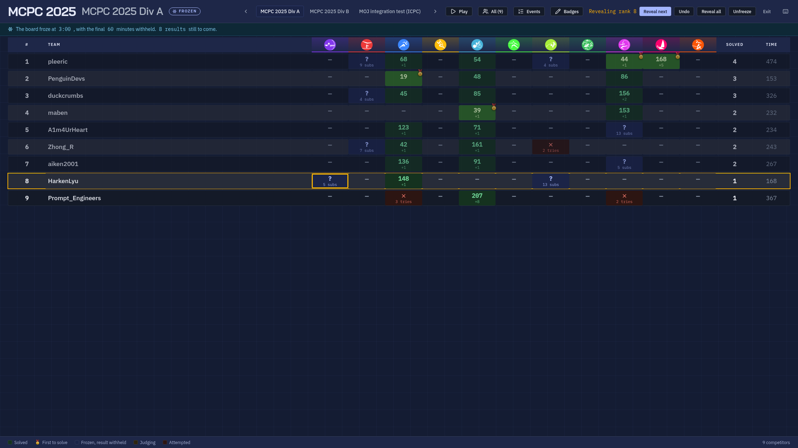

### Profiles

A profile shows the point total, the rank, a year of submission activity and the rating history.

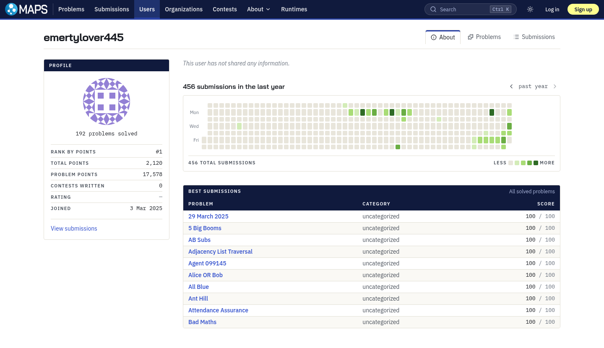

### Staff console

`/admin` covers problems, contests, submissions, scoreboards, jobs, users, organisations, tickets and judges.

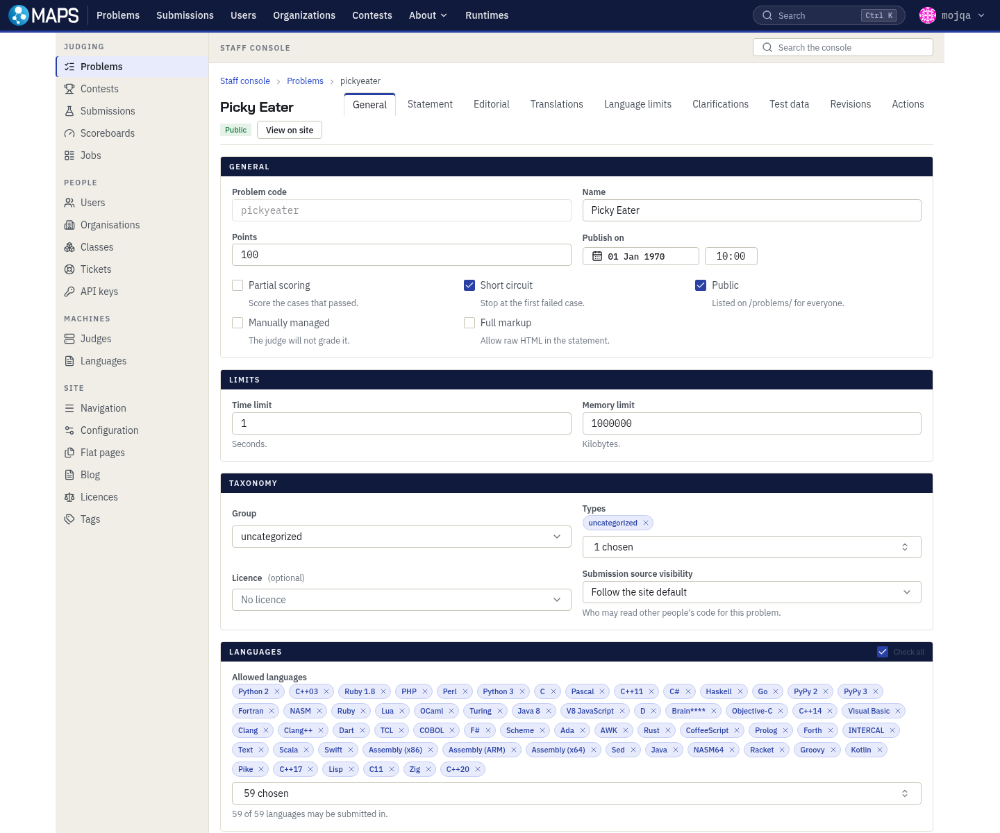

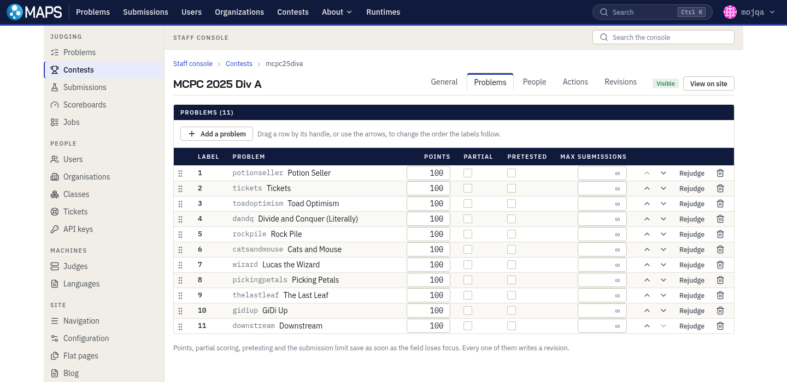

### Two factor authentication

A second factor is a TOTP app with scratch codes, or a passkey, which also signs someone in on its own.

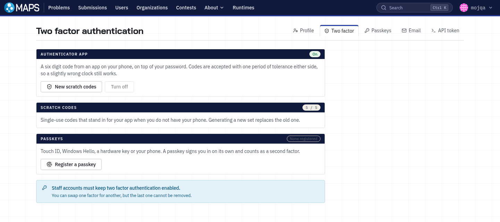

### Dark mode

The site follows the viewer's system setting until they choose a theme.

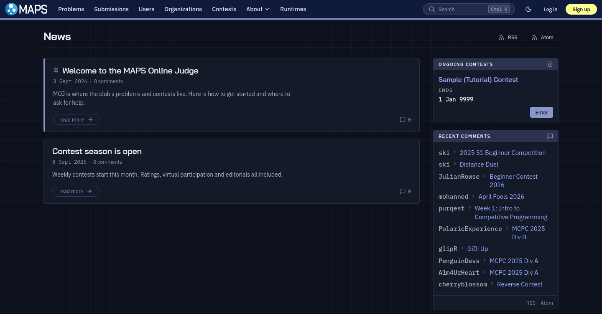

## Supported languages

The judge image decides what a judge can grade, and its tier is picked with `--build-arg TIER=` at build time:

* `tier1` is C through C23, C++03 through C++23, Java 8, Python 2 and 3, PyPy 3, Pascal, Perl, x64 assembly, AWK,
  sed and plain text, about 2.7 GB built. It is the default and covers what a problem set normally needs.
* `tier2` adds the mid-popularity runtimes.
* `tier3` is everything, Clang, Node.js, Lean 4 and LLVM IR included, about 18 GB.

Tiers can be mixed across judges. [`apps/judge/README.md`](apps/judge/README.md) covers the image and the protocol.

## Contributing

```bash
npm run lint            # biome, then oxlint with the anti-slop rules
npm run typecheck       # every workspace
npm test                # vitest
npm run knip            # unused files, dependencies and exports
npm run docs:dev -w docs
```

CI runs the same checks on pull requests, plus the web build, the tier 1 judge image and the judge end to end
test. lefthook runs the linters on staged files before each commit. Commit messages follow
[Conventional Commits](https://www.conventionalcommits.org/en/v1.0.0/).

## Licence

MOJ is free software under the GNU Affero General Public License, version 3 or later. See [LICENSE](LICENSE).
